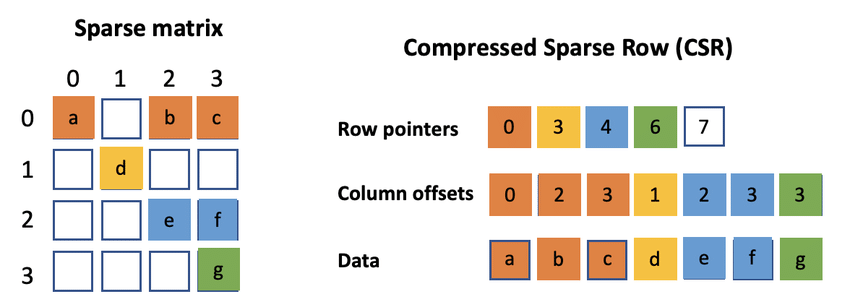
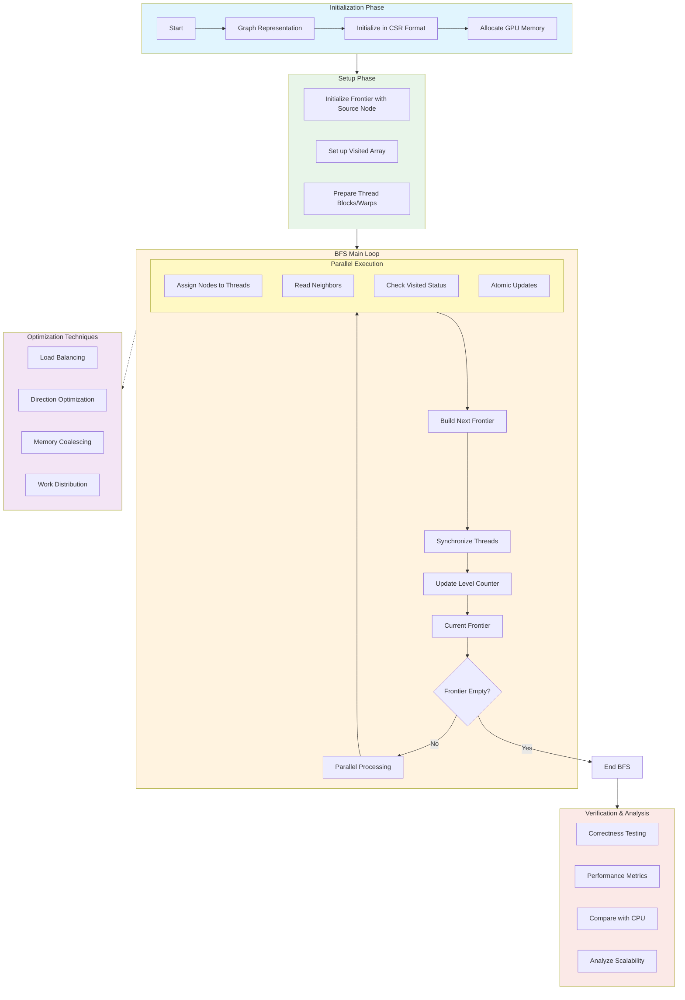

# BFSMetal

### Project: GPU-Accelerated Breadth-First Search with Metal for Memory-Efficient Computations

**BFSMetal** is a high-performance implementation of Breadth-First Search (BFS) using Apple’s Metal framework for GPU acceleration on macOS. This project demonstrates advanced techniques for optimizing memory usage and parallel processing on large-scale graphs, making it directly applicable to memory-efficient challenges in machine learning, such as the "Memory Efficient Backprop" task from Unsloth.

This README explains the project's purpose, features, requirements, usage, and how it relates to Unsloth’s challenge to optimize VRAM usage in large language models (LLMs).

## Motivation

I created BFSMetal to address the "Memory Efficient Backprop" challenge outlined in the Unsloth job posting on X (https://x.com/danielhanchen/status/1891194528931209644). The challenge seeks solutions to reduce VRAM spikes (e.g., 8GB in bfloat16) caused by materializing large logit matrices in LLMs during backpropagation. While BFSMetal focuses on graph traversal, its memory optimization techniques—such as avoiding full data materialization, using efficient data structures (CSR), and leveraging GPU parallelism—can be adapted to tackle similar memory efficiency problems in neural network training, including Unsloth’s goals.
  




This project was developed as a cost-effective alternative to using tools like Cuda, which I couldn’t afford, demonstrating my ability to solve complex technical problems independently.


## Features

- **GPU Acceleration**: Leverages Apple’s Metal framework for parallel execution on macOS GPUs, achieving ~1.6x speedup over CPU implementations for large graphs (100K vertices, ~5M edges).
- **Memory Efficiency**: Uses Compressed Sparse Row (CSR) format and optimizations like memory coalescing, load balancing, and atomic updates to minimize memory overhead during graph traversal.
- **Scalability**: Handles large-scale graphs efficiently, mimicking real-world machine learning networks (e.g., similarity graphs in LLMs).
- **Testing & Verification**: Includes comprehensive unit tests, performance benchmarks, and comparisons between CPU and GPU implementations to ensure correctness and efficiency.
- **Portability**: Designed for macOS 12.0+ with Swift 5.9, ensuring compatibility with modern Apple hardware.


## Architecture

The BFSMetal implementation follows a structured pipeline for efficient GPU-based graph traversal. Below is a visual representation of the architecture:



This flowchart illustrates the initialization, setup, main loop, optimizations, and verification phases of BFSMetal, emphasizing its parallel and memory-efficient design.


## Requirements

- **Operating System**: macOS 12.0 or later
- **Language**: Swift 5.9 or later
- **Hardware**: Metal-capable Apple device (e.g., Mac with an Apple Silicon chip or compatible GPU)


## Installation & Usage

### Build and Run

1. Clone the repository or download the source code.
2. Navigate to the project directory and build the project:
   ```bash
   rm -rf .build
   swift package clean
   swift package reset
   swift build
   ```
3. Run tests to verify functionality:
   ```bash
   swift test
   ```
4. Run the ML-scale performance test specifically:
   ```bash
   swift test --filter MLScaleTests
   ```

Example outputs:
```bash
Building for debugging...
[14/14] Applying BFSMetal
Build complete! (6.87s)
Building for debugging...
[12/12] Linking BFSMetalPackageTests
Build complete! (9.89s)
Test Suite 'All tests' started at 2025-02-22 11:13:55.962.
Test Suite 'BFSMetalPackageTests.xctest' started at 2025-02-22 11:13:55.963.
Test Suite 'BFSTests' started at 2025-02-22 11:13:55.963.
Test Case '-[BFSMetalTests.BFSTests testCPUvsGPUBFS]' started.
Test Case '-[BFSMetalTests.BFSTests testCPUvsGPUBFS]' passed (0.471 seconds).
Test Case '-[BFSMetalTests.BFSTests testMetalBFS]' started.
Test Case '-[BFSMetalTests.BFSTests testMetalBFS]' passed (0.002 seconds).
Test Suite 'BFSTests' passed at 2025-02-22 11:13:56.437.
	 Executed 2 tests, with 0 failures (0 unexpected) in 0.473 (0.473) seconds
Test Suite 'MLScaleTests' started at 2025-02-22 11:13:56.437.
Test Case '-[BFSMetalTests.MLScaleTests testLargeScaleGraphPerformance]' started.
Test Case '-[BFSMetalTests.MLScaleTests testLargeScaleGraphPerformance]' passed (4.642 seconds).
Test Suite 'MLScaleTests' passed at 2025-02-22 11:14:01.079.
	 Executed 1 test, with 0 failures (0 unexpected) in 4.642 (4.642) seconds
Test Suite 'BFSMetalPackageTests.xctest' passed at 2025-02-22 11:14:01.079.
	 Executed 3 tests, with 0 failures (0 unexpected) in 5.115 (5.116) seconds
Test Suite 'All tests' passed at 2025-02-22 11:14:01.079.
	 Executed 3 tests, with 0 failures (0 unexpected) in 5.115 (5.117) seconds
Loaded shader source successfully
Loaded shader source successfully

Graph Statistics:
Vertices: 100000
Total Edges: 4999913
Average Degree: 49.99913
Loaded shader source successfully

Performance Comparison:
CPU Time: 1.070 seconds
GPU Time: 0.652 seconds
Speedup: 1.64x

Traversal Statistics:
Reachable vertices: 100000 (100.0%)
Maximum distance from source: 6
◇ Test run started.
↳ Testing Library Version: 102 (arm64e-apple-macos13.0)
✔ Test run with 0 tests passed after 0.001 seconds.
```
### Example Usage

To perform BFS on a sample graph, use the provided `main.swift` file, which creates a small graph and runs both CPU and GPU implementations for comparison.

Example outputs:
```bash
(base) ➜  BFSMetal swift run
Building for debugging...
[7/7] Applying BFSMetal
Build of product 'BFSMetal' complete! (1.67s)
Running BFS from vertex 0...

Distances from source:
Vertex 0: 0
Vertex 1: 1
Vertex 2: 1
Vertex 3: 2
Vertex 4: 2
Vertex 5: 3

Path from 0 to 5:
0 -> 1 -> 3 -> 5

Statistics:
BFS Statistics:
- Reachable vertices: 6
- Maximum distance: 3
```

## Performance

In testing with large graphs (100K vertices, ~5M edges), BFSMetal achieves:
- **Speedup**: ~1.6x faster than the CPU implementation.
- **Processing Time**: Traverses 5 million edges in under 1 second.
- **Memory Efficiency**: Minimizes VRAM usage through optimizations like CSR format and incremental processing, relevant to Unsloth’s memory-efficient backprop challenge.


## Relevance to Unsloth’s Challenge

The "Memory Efficient Backprop" task from Unsloth seeks to reduce VRAM usage in LLMs by avoiding materialization of large logit matrices (e.g., 128K vocabulary size causing 8GB VRAM spikes in bfloat16). BFSMetal’s techniques can be directly applied or inspire solutions for this challenge:

- **Memory Optimization**: BFSMetal avoids full materialization of graph data using CSR and incremental frontier processing, similar to Unsloth’s goal of computing logits on-the-fly.
- **Parallel Processing**: The GPU-parallel approach in BFSMetal mirrors the parallel computation needed for efficient backpropagation in LLMs.
- **Scalability**: The project’s ability to handle large-scale graphs demonstrates scalability, a critical requirement for LLM optimization.

### Acknowledgments
---
- Inspired by Unsloth’s mission to democratize AI and optimize large-scale machine learning workloads.
- Built using Apple’s Metal framework and Swift, leveraging modern macOS capabilities.
